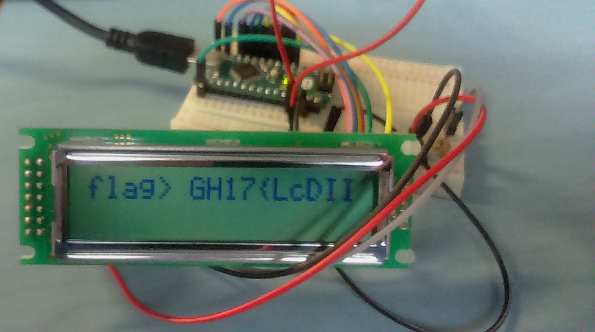

# lcd_0verflow
author : dok  
category : Hardware  
points : 100  
file : lcd_0verflow.tar.gz  
sha1sum : 1be655db3540a961ec92ca65a700ca197ab225a3  

description:  
>
> If only I had a bigger screen.  
> note:  
> .sr work with sigrok  
> .vcd work with gtk-wave  
>

    
Flag (click to discover/hide)

    
GH17{LcDII_3az1Er_Re4D_7haN_C4p}

 

