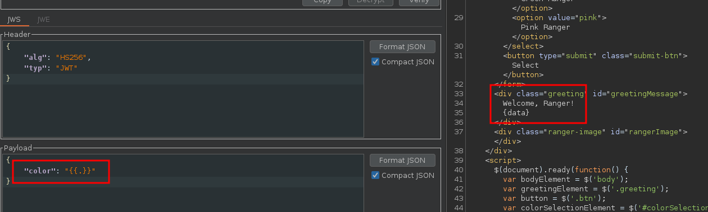

# Solve GoGo Power Rangers

The app appears to be a simple Power Ranger selector with some quotes.


There is a little block of JavaScript : 

```javascript
        $(document).ready(function() {
            var bodyElement = $('body');
            var greetingElement = $('.greeting');
            var button = $('.btn');
            var colorSelectionElement = $('#colorSelection');
            var rangerImageElement = $('#rangerImage');
            var title = $('.form-header');

            function setColorTheme(color) {
                switch (color) {
                    case 'red':
                        rangerImageElement.css('background-image', 'url("/static/img/red_ranger.png")');
                        rangerImageElement.css('border', '2px solid red');
                        greetingElement.css('color', 'red');
                        greetingElement.css('border', '2px solid red');
                        button.css('background-color', 'red');
                        title.css('color', 'red');
                        break;
                    // same for all colors
                    default:
                        rangerImageElement.css('background-image', '');
                        greetingElement.css('color', 'black');
                }
            }

            $("#colorForm").on("submit", function(event) {
                event.preventDefault();

                var formData = $(this).serialize();
                var colorSelectionValue = colorSelectionElement.val();
                $.ajax({
                    url: '/',
                    type: 'POST',
                    data: formData,
                    success: function(data) {
                        $("#greetingMessage").html(data);
                        setColorTheme(colorSelectionValue);
                    }
                });
            });
        });
```

According to the JavaScript sources, when we choose a Power Ranger, this POST request is made to the back : 


This POST request is used to update the JWT color, and anything can be used and reflected


Now we have a JWT with a different value, we can try to use it on the main page 


That's mean that we control this entry that is reflected on the page.
When we look at the source code, it's seem to use a template to parse this entry.

```go
parsedColorTemplate := tpl.String()

data := struct {
    Greeting            string
    dumObj              *dummyObj
    ParsedColorTemplate string
}{
    Greeting:            "Welcome, Ranger!",
    dumObj:              dumObj,
    ParsedColorTemplate: parsedColorTemplate,
}

t, _ := template.ParseFiles("colors.html")
t.ExecuteTemplate(w, "colors.html", data)
```

We can confirm the SSTI with theses payloads : 




And as we can see, there is a method called in the template function to retrive the JWT SECRET from the environment.

```go
func (obj *dummyObj) Readenv(key string) string {
	return os.Getenv(key)
}

// snipped

func ColorSelection(w http.ResponseWriter, r *http.Request) {
    // snipped
		tkn, err := jwt.ParseWithClaims(tknStr, claims, func(token *jwt.Token) (interface{}, error) {
			return []byte(os.Getenv("JWT_SECRET")), nil
		})
```

So we can use it in the SSTI to retrive the FLAG from ENV

